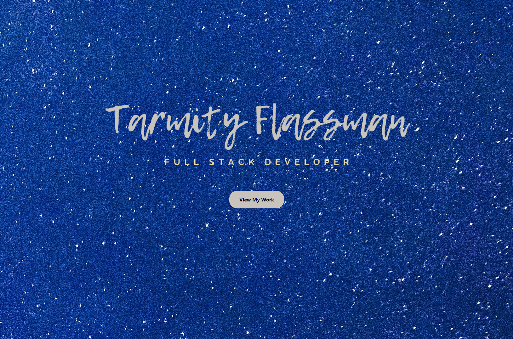

# Tarmity Portfolio

## Description 

This repository is where I developed Tarmity-s-Portfolio. Not only do we work on code and issues here, I also publish the latested updates and functions. This source code is available to everyone under the Free Software Foundation, Inc. https//fsf.org/.

I also built this website to show future employer's and to have all my work on show in one simple click of a button. 

## Table of Contents (Optional)

If your README is very long, add a table of contents to make it easy for users to find what they need.

* [Installation](#installation)
* [Usage](#usage)
* [Credits](#credits)

## Installation

There are no installation guide as it is a woking web page that you go too. https://tarmity.github.io/Tarmity-s-Portfolio/

## Usage 

To acess my portfolio simply open the link (https://tarmity.github.io/Tarmity-s-Portfolio/) will bring you to the home page pictured above.
Once you are on the home page click the button to view my work, this will bring you to my portfolio. you will also notice that there is a Nav bar at the top with links to my resume, about me and a contact page. 

## Credits

Thank you to Bootstrap: <https://getbootstrap.com/>

